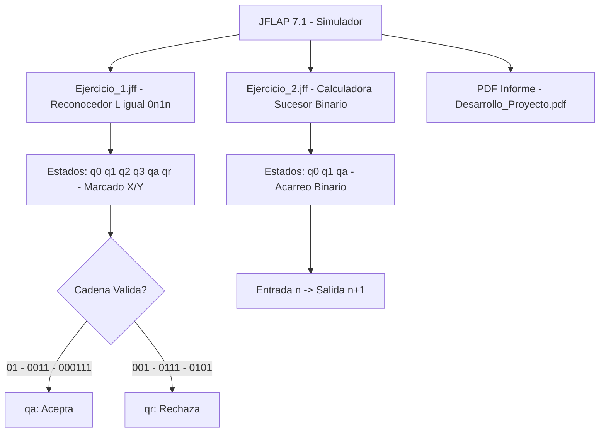

<h1 align="center">🤖 Máquinas de Turing con JFLAP</h1>

<div align="center">


**Laboratorio de Informática Teórica**  
*Fundación Universitaria Internacional de La Rioja*

[📚 Ver Documentación](#-documentación) • [🎯 Ejercicios](#-ejercicios-implementados) • [🚀 Uso](#-cómo-usar) • [👨‍💻 Autor](#-autor)

</div>

---

## 📋 Descripción

Este repositorio contiene la implementación práctica de **Máquinas de Turing** utilizando la herramienta JFLAP, desarrollado como parte del Laboratorio No. 1 de la asignatura de Informática Teórica.

El proyecto demuestra dos tipos fundamentales de Máquinas de Turing:
- 🔍 **Máquinas Reconocedoras**: Deciden si una cadena pertenece a un lenguaje formal
- ⚙️ **Máquinas Computadoras**: Ejecutan procedimientos algorítmicos concretos

---

## 🎯 Ejercicios Implementados

### Ejercicio 1: Reconocedor del Lenguaje L = {0ⁿ1ⁿ : n > 0}

**Objetivo**: Diseñar una Máquina de Turing que reconozca cadenas con igual cantidad de ceros y unos.

**Estrategia**: Algoritmo de marcado y emparejamiento
- ✅ Marca cada `0` como `X`
- ✅ Busca y marca el `1` correspondiente como `Y`
- ✅ Repite hasta emparejar todos los símbolos
- ✅ Verifica que no sobren símbolos

**Estados**: `q0`, `q1`, `q2`, `q3`, `qa`, `qr`

#### Cadenas de Prueba

<div align="center">
   
| ✅ Aceptadas | ❌ Rechazadas |
|:-------------:|:---------------:|
| `01` | `ε` (vacía) |
| `0011` | `1` |
| `000111` | `001` |
| `00001111` | `0111` |
| `0000011111` | `0101` |

</div>

---

### Ejercicio 2: Calculadora del Sucesor Binario

**Objetivo**: Diseñar una Máquina de Turing que calcule n+1 de un número binario.

**Estrategia**: Suma binaria con propagación de acarreo
- ✅ Se posiciona en el bit menos significativo
- ✅ Aplica reglas de suma binaria
- ✅ Propaga el acarreo hacia la izquierda
- ✅ Añade dígito adicional si es necesario

**Estados**: `q0`, `q1`, `qa`

#### Ejemplos de Funcionamiento

<div align="center">

| Entrada | Salida |
|:-------:|:------:|
| `0` | `1` |
| `1` | `10` |
| `10` | `11` |
| `111` | `1000` |
| `1011` | `1100` |

</div>

---

## 📁 Estructura del Repositorio
```
Maquinas_De_Turing_Con_JFLAP/
├── 📄 README.md
├── 🔒 .gitignore
├── 📘 Desarrollo_Proyecto_Alejandro_De_Mendoza.pdf
├── 🤖 Maquinas_de_Turing_con_JFLAP_Ejercicio_1.jff
├── 🤖 Maquinas_de_Turing_con_JFLAP_Ejercicio_2.jff
└── 📂 files/
    ├── COMANDOS_GIT.ps1
    └── COMANDOS_RAPIDOS.ps1
```

---

## 🛠️ Tecnologías Utilizadas

- **JFLAP 7.1**: Software educativo para diseño y simulación de autómatas
- **Java**: Requerido para ejecutar JFLAP
- **LaTeX/Word**: Documentación del proyecto

---

## 🚀 Cómo Usar

### Prerrequisitos

1. Descargar e instalar [JFLAP](http://www.jflap.org/jflaptmp/)
2. Tener Java instalado (JRE 8 o superior)

### Ejecución

1. **Clonar el repositorio**
```bash
   git clone https://github.com/AlejoTechEngineer/Maquinas_De_Turing_Con_JFLAP.git
   cd Maquinas_De_Turing_Con_JFLAP
```

2. **Abrir JFLAP**
```bash
   java -jar JFLAP.jar
```

3. **Cargar un ejercicio**
   - File → Open → Seleccionar `.jff` deseado

4. **Ejecutar simulación**
   - Input → Step... (para ejecución paso a paso)
   - Input → Multiple Run (para pruebas masivas)

---

## 📚 Documentación

El documento completo del laboratorio incluye:

- ✅ Introducción teórica a las Máquinas de Turing
- ✅ Análisis detallado de cada lenguaje
- ✅ Diseño de estados y transiciones
- ✅ Diagramas de flujo completos
- ✅ Pruebas exhaustivas con capturas de pantalla
- ✅ Conclusiones sobre computabilidad

**Leer el informe completo**: [`Desarrollo_Proyecto_Alejandro_De_Mendoza.pdf`](./Desarrollo_Proyecto_Alejandro_De_Mendoza.pdf)

---

## 🎓 Conceptos Clave

### Máquinas Reconocedoras vs Computadoras

<div align="center">

| Característica | Reconocedoras | Computadoras |
|:---------------|:---------------|:--------------|
| **Propósito** | Decidir membresía en un lenguaje | Ejecutar cálculos |
| **Salida** | Acepta/Rechaza | Resultado computado |
| **Ejemplo** | L = {0ⁿ1ⁿ} | Sucesor binario |
| **Uso** | Verificación formal | Operaciones aritméticas |

</div>

---

## 📊 Resultados

### Ejercicio 1
- ✅ **5/5 cadenas aceptadas** correctamente
- ✅ **5/5 cadenas rechazadas** correctamente
- ✅ **100% de precisión** en el reconocimiento

### Ejercicio 2
- ✅ **5/5 pruebas** calculadas correctamente
- ✅ **Propagación de acarreo** funcionando perfectamente
- ✅ **Manejo de casos borde** (todos 1s) exitoso

---

## 🔬 Validación

Todas las máquinas fueron validadas usando:
- ✅ Simulación paso a paso en JFLAP
- ✅ Pruebas unitarias con casos límite
- ✅ Verificación manual de transiciones
- ✅ Análisis de complejidad temporal

---

## 👨‍💻 Autor

**Alejandro De Mendoza**  
Ingeniería Informática  
Fundación Universitaria Internacional de La Rioja

🔗 GitHub: [@AlejoTechEngineer](https://github.com/AlejoTechEngineer)

---

## 📅 Información del Proyecto

- **Asignatura**: Informática Teórica (COLGII)
- **Periodo**: Enero 2026 - PER 15746
- **Fecha de Entrega**: 16 de Febrero de 2026
- **Tipo**: Laboratorio Práctico No. 1

---

## 📖 Referencias Bibliográficas

- Sipser, M. (2013). *Introduction to the theory of computation* (3rd ed.). Cengage Learning.
- Hopcroft, J. E., Motwani, R., & Ullman, J. D. (2007). *Introduction to automata theory, languages, and computation* (3rd ed.). Pearson.
- Turing, A. M. (1936). On computable numbers, with an application to the Entscheidungsproblem. *Proceedings of the London Mathematical Society*, 42(2), 230–265.
- Rodger, S. H., & Finley, T. W. (2006). *JFLAP: An interactive formal languages and automata package*. Jones & Bartlett Learning.

---

## 📜 Licencia

Este proyecto es material académico desarrollado para fines educativos.

---

## 🙏 Agradecimientos

- Al profesor Ing. Rogerio Orlando Beltrán Castro por su guía y conocimientos
- A la Fundación Universitaria Internacional de La Rioja por los recursos proporcionados
- A los creadores de JFLAP por esta excelente herramienta educativa

---

<div align="center">

**⭐ Si este proyecto te fue útil, considera darle una estrella ⭐**

Made with ❤️ and ☕ by Alejandro De Mendoza

</div>
## Arquitectura


